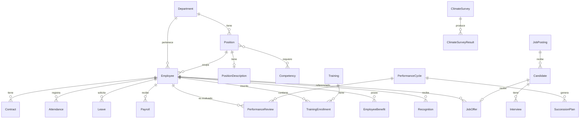
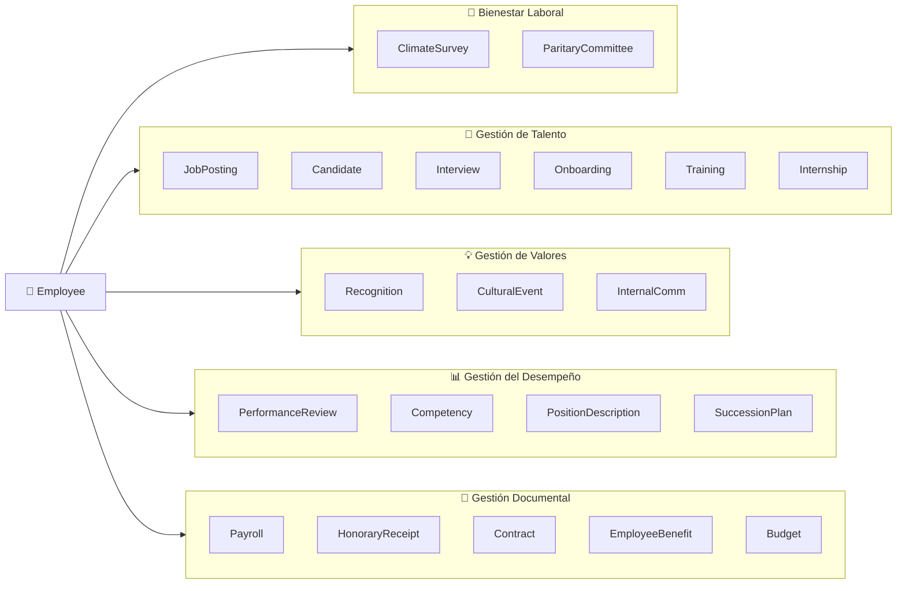

# Modelo de Datos GDP

Descripción de las entidades principales del sistema y sus relaciones.

## Diagrama Entidad-Relación



## Diagrama de Módulos del Sistema



## Organización por Macro-Módulo RRHH

---

## Entidades Principales

### `Employee` — Colaborador

Tabla central del sistema. Representa a cada persona que trabaja o trabajó en Surmedia.

| Campo | Tipo | Descripción |
|---|---|---|
| `id` | UUID | Identificador único interno |
| `rut` | VARCHAR(12) | RUT chileno cifrado (ej: 12.345.678-9) |
| `first_name` | VARCHAR(100) | Nombre(s) |
| `last_name` | VARCHAR(100) | Apellido paterno |
| `second_last_name` | VARCHAR(100) | Apellido materno |
| `email_work` | VARCHAR(255) | Correo corporativo (@surmedia.cl) |
| `email_personal` | VARCHAR(255) | Correo personal |
| `phone` | VARCHAR(20) | Teléfono |
| `birth_date` | DATE | Fecha de nacimiento |
| `gender` | ENUM | `MALE`, `FEMALE`, `OTHER`, `PREFER_NOT_TO_SAY` |
| `nationality` | VARCHAR(50) | Nacionalidad |
| `address` | TEXT | Dirección |
| `commune` | VARCHAR(100) | Comuna |
| `city` | VARCHAR(100) | Ciudad |
| `region` | VARCHAR(100) | Región |
| `afp` | ENUM | `HABITAT`, `CAPITAL`, `CUPRUM`, `MODELO`, `PLANVITAL`, `PROVIDA`, `UNO` |
| `health_institution` | ENUM | `FONASA`, `ISAPRE` |
| `health_institution_name` | VARCHAR(100) | Nombre de Isapre (si aplica) |
| `position_id` | UUID | FK → `Position` |
| `department_id` | UUID | FK → `Department` |
| `manager_id` | UUID | FK → `Employee` (jefatura directa) |
| `buk_id` | VARCHAR(50) | ID del colaborador en BUK |
| `status` | ENUM | `ACTIVE`, `INACTIVE`, `ON_LEAVE` |
| `hire_date` | DATE | Fecha de ingreso a la empresa |
| `termination_date` | DATE | Fecha de término (si aplica) |
| `termination_reason` | ENUM | Causal de término (Art. 159, 160, 161) |
| `created_at` | TIMESTAMPTZ | Fecha de creación del registro |
| `updated_at` | TIMESTAMPTZ | Última actualización |
| `deleted_at` | TIMESTAMPTZ | Soft delete |

**Contacto de Emergencia (tabla separada `EmergencyContact`):**

| Campo | Tipo | Descripción |
|---|---|---|
| `id` | UUID | |
| `employee_id` | UUID | FK → `Employee` |
| `name` | VARCHAR(200) | Nombre del contacto |
| `relationship` | VARCHAR(50) | Parentesco |
| `phone` | VARCHAR(20) | Teléfono |

---

### `Department` — Departamento

| Campo | Tipo | Descripción |
|---|---|---|
| `id` | UUID | |
| `name` | VARCHAR(100) | Nombre del departamento |
| `code` | VARCHAR(20) | Código abreviado (ej: `TECH`, `COMM`, `ADM`) |
| `parent_id` | UUID | FK → `Department` (para sub-áreas) |
| `manager_id` | UUID | FK → `Employee` (jefe de área) |
| `cost_center` | VARCHAR(50) | Centro de costo contable |
| `is_active` | BOOLEAN | |

**Departamentos iniciales de Surmedia:** (confirmar con organigrama real)
- Tecnología (`TECH`)
- Comunicaciones / Contenidos (`COMM`)
- Administración y Finanzas (`ADM`)
- Comercial (`COM`)
- Recursos Humanos (`RRHH`)
- Diseño (`DES`)

---

### `Position` — Cargo

| Campo | Tipo | Descripción |
|---|---|---|
| `id` | UUID | |
| `title` | VARCHAR(150) | Nombre del cargo |
| `department_id` | UUID | FK → `Department` |
| `level` | ENUM | `INTERN`, `JUNIOR`, `SENIOR`, `LEAD`, `MANAGER`, `DIRECTOR`, `C_LEVEL` |
| `is_active` | BOOLEAN | |

---

### `Contract` — Contrato Laboral

| Campo | Tipo | Descripción |
|---|---|---|
| `id` | UUID | |
| `employee_id` | UUID | FK → `Employee` |
| `type` | ENUM | `INDEFINITE`, `FIXED_TERM`, `PART_TIME`, `INTERNSHIP`, `FREELANCE` |
| `start_date` | DATE | Inicio del contrato |
| `end_date` | DATE | Término (null si es indefinido) |
| `base_salary` | INTEGER | Remuneración base en CLP (sin decimales) |
| `currency` | VARCHAR(3) | Siempre `CLP` |
| `work_schedule` | ENUM | `FULL_TIME`, `PART_TIME`, `REMOTE`, `HYBRID` |
| `weekly_hours` | INTEGER | Horas semanales contractuales |
| `work_mode` | ENUM | `ON_SITE`, `REMOTE`, `HYBRID` |
| `buk_contract_id` | VARCHAR(50) | ID del contrato en BUK |
| `document_url` | TEXT | URL al contrato firmado en Google Drive |
| `is_current` | BOOLEAN | Contrato vigente |
| `created_at` | TIMESTAMPTZ | |
| `updated_at` | TIMESTAMPTZ | |

---

### `Attendance` — Registro de Asistencia

Sincronizado desde BUK Asistencia.

| Campo | Tipo | Descripción |
|---|---|---|
| `id` | UUID | |
| `employee_id` | UUID | FK → `Employee` |
| `date` | DATE | Fecha del marcaje |
| `check_in` | TIMESTAMPTZ | Hora de entrada |
| `check_out` | TIMESTAMPTZ | Hora de salida |
| `worked_hours` | DECIMAL(5,2) | Horas trabajadas calculadas |
| `overtime_hours` | DECIMAL(5,2) | Horas extra |
| `status` | ENUM | `PRESENT`, `ABSENT`, `LATE`, `REMOTE`, `ON_LEAVE` |
| `source` | ENUM | `BUK_ASISTENCIA`, `MANUAL` |
| `notes` | TEXT | Observaciones |

---

### `Leave` — Vacaciones y Permisos

| Campo | Tipo | Descripción |
|---|---|---|
| `id` | UUID | |
| `employee_id` | UUID | FK → `Employee` |
| `type` | ENUM | `VACATION`, `SICK_LEAVE`, `MATERNITY`, `PATERNITY`, `ADMINISTRATIVE`, `OTHER` |
| `start_date` | DATE | Inicio del permiso |
| `end_date` | DATE | Fin del permiso |
| `days` | INTEGER | Días hábiles |
| `status` | ENUM | `PENDING`, `APPROVED`, `REJECTED`, `CANCELLED` |
| `approver_id` | UUID | FK → `Employee` (quien aprueba) |
| `approved_at` | TIMESTAMPTZ | |
| `rejection_reason` | TEXT | Motivo de rechazo |
| `buk_request_id` | VARCHAR(50) | ID de la solicitud en BUK |
| `created_at` | TIMESTAMPTZ | |

**Saldo de Vacaciones (`LeaveBalance`):**

| Campo | Tipo | Descripción |
|---|---|---|
| `id` | UUID | |
| `employee_id` | UUID | FK → `Employee` |
| `year` | INTEGER | Año |
| `entitled_days` | INTEGER | Días con derecho (por ley: 15 días) |
| `used_days` | INTEGER | Días utilizados |
| `pending_days` | INTEGER | Días pendientes de años anteriores |
| `available_days` | INTEGER | Días disponibles (calculado) |

---

### `Payroll` — Liquidación de Sueldo

Sincronizado desde BUK.

| Campo | Tipo | Descripción |
|---|---|---|
| `id` | UUID | |
| `employee_id` | UUID | FK → `Employee` |
| `period_year` | INTEGER | Año del período |
| `period_month` | INTEGER | Mes del período (1-12) |
| `base_salary` | INTEGER | Sueldo base (CLP) |
| `gross_salary` | INTEGER | Sueldo bruto (CLP) |
| `net_salary` | INTEGER | Sueldo líquido (CLP) |
| `afp_amount` | INTEGER | Monto cotización AFP (CLP) |
| `health_amount` | INTEGER | Monto cotización salud (CLP) |
| `tax_amount` | INTEGER | Impuesto único de segunda categoría (CLP) |
| `total_deductions` | INTEGER | Total deducciones (CLP) |
| `total_allowances` | INTEGER | Total asignaciones/bonos (CLP) |
| `buk_payroll_id` | VARCHAR(50) | ID en BUK |
| `document_url` | TEXT | URL a la liquidación en Drive |
| `previred_declared` | BOOLEAN | Si fue declarado en Previred |
| `previred_declared_at` | TIMESTAMPTZ | Fecha de declaración |
| `created_at` | TIMESTAMPTZ | |

---

### `Performance` — Evaluación de Desempeño

| Campo | Tipo | Descripción |
|---|---|---|
| `id` | UUID | |
| `employee_id` | UUID | FK → `Employee` |
| `evaluator_id` | UUID | FK → `Employee` |
| `period` | VARCHAR(20) | Ej: `2024-H1`, `2024-ANNUAL` |
| `score` | DECIMAL(4,2) | Puntaje (ej: 1.0 a 5.0) |
| `status` | ENUM | `DRAFT`, `IN_PROGRESS`, `COMPLETED` |
| `goals` | JSONB | Metas y resultados |
| `feedback` | TEXT | Retroalimentación general |
| `completed_at` | TIMESTAMPTZ | |
| `created_at` | TIMESTAMPTZ | |

---

### `Document` — Documentos del Colaborador

| Campo | Tipo | Descripción |
|---|---|---|
| `id` | UUID | |
| `employee_id` | UUID | FK → `Employee` |
| `type` | ENUM | `CONTRACT`, `ANNEX`, `PAYROLL`, `TERMINATION`, `CERTIFICATE`, `ID_CARD`, `OTHER` |
| `name` | VARCHAR(255) | Nombre descriptivo del documento |
| `file_url` | TEXT | URL en Google Drive |
| `drive_file_id` | VARCHAR(255) | ID del archivo en Google Drive |
| `uploaded_by` | UUID | FK → `Employee` |
| `created_at` | TIMESTAMPTZ | |

---

---

## Módulo: Gestión de Bienestar Laboral

### `ClimateSurvey` — Encuesta de Clima Laboral

| Campo | Tipo | Descripción |
|---|---|---|
| `id` | UUID | |
| `name` | VARCHAR(200) | Nombre de la encuesta |
| `type` | ENUM | `CEAL_SUCESO`, `INTERNAL`, `PARITARY_COMMITTEE`, `OTHER` |
| `period_year` | INTEGER | Año de aplicación |
| `period` | VARCHAR(50) | Ej: `2024-H1`, `2024-Q3` |
| `status` | ENUM | `DRAFT`, `ACTIVE`, `CLOSED`, `REPORTED` |
| `start_date` | DATE | Inicio del período de respuesta |
| `end_date` | DATE | Cierre del período de respuesta |
| `form_url` | TEXT | URL al formulario (Google Forms u otro) |
| `results_url` | TEXT | URL al informe de resultados en Drive |
| `created_by` | UUID | FK → `Employee` |
| `created_at` | TIMESTAMPTZ | |

**Nota:** Las respuestas individuales de CEAL-SUCESO son procesadas externamente por el MINSAL; GDP registra solo el resultado agregado y los metadatos del proceso.

### `ClimateSurveyResult` — Resultado Agregado de Encuesta

| Campo | Tipo | Descripción |
|---|---|---|
| `id` | UUID | |
| `survey_id` | UUID | FK → `ClimateSurvey` |
| `participation_rate` | DECIMAL(5,2) | % de participación |
| `overall_score` | DECIMAL(5,2) | Puntaje general |
| `dimension_scores` | JSONB | Puntajes por dimensión |
| `department_id` | UUID | FK → `Department` (null = resultado global) |
| `created_at` | TIMESTAMPTZ | |

### `ParitaryCommitteeMeeting` — Acta Comité Paritario

| Campo | Tipo | Descripción |
|---|---|---|
| `id` | UUID | |
| `meeting_date` | DATE | Fecha de la reunión |
| `attendees` | JSONB | Lista de asistentes |
| `topics` | TEXT | Temas tratados |
| `agreements` | TEXT | Acuerdos adoptados |
| `document_url` | TEXT | URL al acta en Google Drive |
| `created_at` | TIMESTAMPTZ | |

---

## Módulo: Gestión de Talento

### `Training` — Capacitación

| Campo | Tipo | Descripción |
|---|---|---|
| `id` | UUID | |
| `name` | VARCHAR(255) | Nombre de la capacitación |
| `type` | ENUM | `EXTERNAL_DIPLOMADO`, `EXTERNAL_MAGISTER`, `EXTERNAL_COPAGADO`, `EXTERNAL_SENCE`, `INTERNAL_LEADERSHIP`, `INTERNAL_WORKSHOP` |
| `modality` | ENUM | `IN_PERSON`, `ONLINE`, `HYBRID` |
| `provider` | VARCHAR(200) | Institución o proveedor |
| `duration_hours` | INTEGER | Duración en horas |
| `start_date` | DATE | Inicio |
| `end_date` | DATE | Término |
| `total_cost` | INTEGER | Costo total en CLP |
| `sence_code` | VARCHAR(50) | Código SENCE (si aplica) |
| `sence_subsidy` | INTEGER | Monto subsidio SENCE en CLP |
| `company_cost` | INTEGER | Costo neto empresa en CLP |
| `status` | ENUM | `PLANNED`, `IN_PROGRESS`, `COMPLETED`, `CANCELLED` |
| `document_url` | TEXT | Documentación en Drive |
| `created_at` | TIMESTAMPTZ | |

### `TrainingEnrollment` — Inscripción en Capacitación

| Campo | Tipo | Descripción |
|---|---|---|
| `id` | UUID | |
| `training_id` | UUID | FK → `Training` |
| `employee_id` | UUID | FK → `Employee` |
| `status` | ENUM | `ENROLLED`, `COMPLETED`, `FAILED`, `DROPPED` |
| `completion_date` | DATE | Fecha de finalización |
| `certificate_url` | TEXT | URL al certificado en Drive |
| `grade` | VARCHAR(20) | Nota o calificación (si aplica) |
| `employee_copayment` | INTEGER | Copago del trabajador en CLP |
| `created_at` | TIMESTAMPTZ | |

### `Internship` — Práctica Laboral

| Campo | Tipo | Descripción |
|---|---|---|
| `id` | UUID | |
| `employee_id` | UUID | FK → `Employee` (tipo `INTERNSHIP`) |
| `university` | VARCHAR(200) | Universidad o institución |
| `career` | VARCHAR(200) | Carrera que estudia |
| `supervisor_id` | UUID | FK → `Employee` (tutor interno) |
| `start_date` | DATE | Inicio de práctica |
| `end_date` | DATE | Término de práctica |
| `monthly_allowance` | INTEGER | Monto mensual en CLP |
| `budget_year` | INTEGER | Año presupuestario |
| `status` | ENUM | `ACTIVE`, `COMPLETED`, `CANCELLED` |
| `created_at` | TIMESTAMPTZ | |

### `JobPosting` — Vacante

| Campo | Tipo | Descripción |
|---|---|---|
| `id` | UUID | |
| `position_id` | UUID | FK → `Position` |
| `department_id` | UUID | FK → `Department` |
| `title` | VARCHAR(200) | Título del aviso |
| `description` | TEXT | Descripción del cargo |
| `requirements` | TEXT | Requisitos |
| `type` | ENUM | `INTERNAL`, `EXTERNAL`, `BOTH` |
| `portals` | JSONB | Portales donde se publicó (LinkedIn, Get On Board, etc.) |
| `status` | ENUM | `DRAFT`, `PUBLISHED`, `CLOSED`, `FILLED`, `CANCELLED` |
| `published_at` | TIMESTAMPTZ | |
| `closed_at` | TIMESTAMPTZ | |
| `hiring_manager_id` | UUID | FK → `Employee` |
| `created_at` | TIMESTAMPTZ | |

### `Candidate` — Candidato

| Campo | Tipo | Descripción |
|---|---|---|
| `id` | UUID | |
| `job_posting_id` | UUID | FK → `JobPosting` |
| `full_name` | VARCHAR(200) | Nombre completo |
| `email` | VARCHAR(255) | Correo electrónico |
| `phone` | VARCHAR(20) | Teléfono |
| `cv_url` | TEXT | URL al CV en Drive |
| `source` | ENUM | `LINKEDIN`, `GET_ON_BOARD`, `REFERRAL`, `INTERNAL`, `UNIVERSITY`, `OTHER` |
| `status` | ENUM | `APPLIED`, `SCREENING`, `INTERVIEW`, `TEST`, `OFFER`, `HIRED`, `REJECTED` |
| `rejection_reason` | TEXT | Motivo de descarte |
| `created_at` | TIMESTAMPTZ | |

### `Interview` — Entrevista

| Campo | Tipo | Descripción |
|---|---|---|
| `id` | UUID | |
| `candidate_id` | UUID | FK → `Candidate` |
| `interviewer_id` | UUID | FK → `Employee` |
| `type` | ENUM | `SCREENING`, `TECHNICAL`, `CULTURAL_FIT`, `PANEL`, `FINAL` |
| `scheduled_at` | TIMESTAMPTZ | Fecha y hora programada |
| `meet_link` | TEXT | Link de Google Meet |
| `result` | ENUM | `PENDING`, `APPROVED`, `REJECTED` |
| `notes` | TEXT | Comentarios del entrevistador |
| `created_at` | TIMESTAMPTZ | |

### `JobOffer` — Carta Oferta

| Campo | Tipo | Descripción |
|---|---|---|
| `id` | UUID | |
| `candidate_id` | UUID | FK → `Candidate` |
| `position_id` | UUID | FK → `Position` |
| `offered_salary` | INTEGER | Remuneración ofrecida en CLP |
| `start_date` | DATE | Fecha de ingreso propuesta |
| `contract_type` | ENUM | FK a enum de `Contract.type` |
| `status` | ENUM | `SENT`, `ACCEPTED`, `REJECTED`, `EXPIRED` |
| `sent_at` | TIMESTAMPTZ | |
| `responded_at` | TIMESTAMPTZ | |
| `document_url` | TEXT | URL a la carta oferta en Drive |

---

## Módulo: Gestión de Valores

### `Recognition` — Reconocimiento

| Campo | Tipo | Descripción |
|---|---|---|
| `id` | UUID | |
| `employee_id` | UUID | FK → `Employee` (reconocido) |
| `given_by_id` | UUID | FK → `Employee` (quién reconoce) |
| `type` | VARCHAR(100) | Tipo de reconocimiento (ej: Excelencia, Innovación) |
| `description` | TEXT | Descripción del reconocimiento |
| `period` | VARCHAR(50) | Ej: `2024-Q2` |
| `public` | BOOLEAN | Si se comunica internamente |
| `created_at` | TIMESTAMPTZ | |

### `CulturalEvent` — Evento Cultural / Celebración

| Campo | Tipo | Descripción |
|---|---|---|
| `id` | UUID | |
| `name` | VARCHAR(200) | Nombre del evento |
| `type` | ENUM | `BIRTHDAY`, `ANNIVERSARY`, `ANNUAL_CELEBRATION`, `MEETING_POINT`, `OTHER` |
| `description` | TEXT | Descripción |
| `event_date` | DATE | Fecha del evento |
| `budget` | INTEGER | Presupuesto en CLP |
| `responsible_id` | UUID | FK → `Employee` (organizador) |
| `created_at` | TIMESTAMPTZ | |

### `InternalCommunication` — Comunicación Interna

| Campo | Tipo | Descripción |
|---|---|---|
| `id` | UUID | |
| `channel` | ENUM | `LA_ALCUZA`, `CIRCULOS_SM`, `INTERNAL_CHANNEL`, `OTHER` |
| `title` | VARCHAR(255) | Título de la comunicación |
| `content` | TEXT | Contenido o resumen |
| `published_at` | TIMESTAMPTZ | Fecha de publicación |
| `author_id` | UUID | FK → `Employee` |
| `url` | TEXT | Link al contenido (Drive, plataforma interna) |
| `created_at` | TIMESTAMPTZ | |

---

## Módulo: Gestión del Desempeño

### `Competency` — Competencia Laboral (Diccionario)

| Campo | Tipo | Descripción |
|---|---|---|
| `id` | UUID | |
| `name` | VARCHAR(150) | Nombre de la competencia |
| `description` | TEXT | Descripción de la competencia |
| `type` | ENUM | `CORE`, `LEADERSHIP`, `TECHNICAL`, `FUNCTIONAL` |
| `levels` | JSONB | Definición de niveles (básico, intermedio, avanzado, experto) |
| `is_active` | BOOLEAN | |
| `created_at` | TIMESTAMPTZ | |

### `PositionDescription` — Descriptivo de Cargo

| Campo | Tipo | Descripción |
|---|---|---|
| `id` | UUID | |
| `position_id` | UUID | FK → `Position` |
| `mission` | TEXT | Misión del cargo |
| `responsibilities` | JSONB | Lista de responsabilidades |
| `required_education` | TEXT | Formación requerida |
| `required_experience` | TEXT | Experiencia requerida |
| `competencies` | JSONB | Competencias requeridas con nivel mínimo |
| `version` | INTEGER | Versión del descriptivo |
| `approved_by` | UUID | FK → `Employee` |
| `approved_at` | TIMESTAMPTZ | |
| `document_url` | TEXT | URL al documento en Drive |
| `created_at` | TIMESTAMPTZ | |

### `PerformanceCycle` — Ciclo de Evaluación

| Campo | Tipo | Descripción |
|---|---|---|
| `id` | UUID | |
| `name` | VARCHAR(200) | Ej: `Evaluación Anual 2024` |
| `period` | VARCHAR(20) | Ej: `2024-ANNUAL`, `2024-H1` |
| `start_date` | DATE | Inicio del ciclo |
| `end_date` | DATE | Cierre del ciclo |
| `status` | ENUM | `DRAFT`, `ACTIVE`, `CLOSED` |
| `created_by` | UUID | FK → `Employee` |
| `created_at` | TIMESTAMPTZ | |

### `PerformanceReview` — Evaluación de Desempeño Individual

| Campo | Tipo | Descripción |
|---|---|---|
| `id` | UUID | |
| `cycle_id` | UUID | FK → `PerformanceCycle` |
| `employee_id` | UUID | FK → `Employee` (evaluado) |
| `evaluator_id` | UUID | FK → `Employee` (evaluador) |
| `self_score` | DECIMAL(4,2) | Autoevaluación |
| `manager_score` | DECIMAL(4,2) | Evaluación del jefe |
| `final_score` | DECIMAL(4,2) | Puntaje final consensuado |
| `competency_scores` | JSONB | Puntaje por competencia |
| `goals_achievement` | JSONB | Logro de objetivos |
| `development_plan` | TEXT | Plan de desarrollo acordado |
| `status` | ENUM | `PENDING`, `SELF_EVAL`, `MANAGER_EVAL`, `MEETING_SCHEDULED`, `COMPLETED` |
| `completed_at` | TIMESTAMPTZ | |
| `created_at` | TIMESTAMPTZ | |

### `SuccessionPlan` — Plan de Sucesión

| Campo | Tipo | Descripción |
|---|---|---|
| `id` | UUID | |
| `position_id` | UUID | FK → `Position` (cargo crítico) |
| `current_holder_id` | UUID | FK → `Employee` (titular actual) |
| `successor_id` | UUID | FK → `Employee` (sucesor identificado) |
| `readiness` | ENUM | `READY_NOW`, `READY_1_2_YEARS`, `READY_3_5_YEARS` |
| `development_actions` | TEXT | Acciones de desarrollo planificadas |
| `cycle_id` | UUID | FK → `PerformanceCycle` |
| `created_at` | TIMESTAMPTZ | |

---

## Módulo: Gestión Documental

### `HonoraryReceipt` — Boleta de Honorarios

| Campo | Tipo | Descripción |
|---|---|---|
| `id` | UUID | |
| `provider_rut` | VARCHAR(12) | RUT del prestador (cifrado) |
| `provider_name` | VARCHAR(200) | Nombre del prestador |
| `period_year` | INTEGER | Año del período |
| `period_month` | INTEGER | Mes del período (1-12) |
| `gross_amount` | INTEGER | Monto bruto en CLP |
| `retention_amount` | INTEGER | Monto retención (10.75%) |
| `net_amount` | INTEGER | Monto neto pagado en CLP |
| `service_description` | TEXT | Descripción del servicio |
| `document_number` | VARCHAR(50) | Número de boleta |
| `document_url` | TEXT | URL al documento en Drive |
| `created_at` | TIMESTAMPTZ | |

### `EmployeeBenefit` — Beneficio Asignado

| Campo | Tipo | Descripción |
|---|---|---|
| `id` | UUID | |
| `employee_id` | UUID | FK → `Employee` |
| `type` | ENUM | `PLUXEE_CARD`, `COMPLEMENTARY_INSURANCE`, `OFFICE_ENROLLMENT`, `OTHER` |
| `provider` | VARCHAR(100) | Proveedor del beneficio |
| `policy_number` | VARCHAR(100) | N° póliza o número de contrato |
| `start_date` | DATE | Inicio del beneficio |
| `end_date` | DATE | Término (null si es permanente) |
| `monthly_amount` | INTEGER | Monto mensual CLP (si aplica) |
| `is_active` | BOOLEAN | |
| `document_url` | TEXT | Documentación en Drive |
| `created_at` | TIMESTAMPTZ | |

### `DPDOBudget` — Presupuesto DPDO

| Campo | Tipo | Descripción |
|---|---|---|
| `id` | UUID | |
| `year` | INTEGER | Año presupuestario |
| `category` | ENUM | `TRAINING`, `WELLBEING`, `EVENTS`, `BENEFITS`, `INTERNSHIPS`, `RECRUITMENT`, `OTHER` |
| `planned_amount` | INTEGER | Monto presupuestado en CLP |
| `executed_amount` | INTEGER | Monto ejecutado en CLP (calculado) |
| `notes` | TEXT | Observaciones |
| `document_url` | TEXT | URL al presupuesto en Drive |
| `created_at` | TIMESTAMPTZ | |

---

### `AuditLog` — Registro de Auditoría

| Campo | Tipo | Descripción |
|---|---|---|
| `id` | UUID | |
| `user_id` | UUID | FK → `Employee` (quien realizó la acción) |
| `action` | VARCHAR(100) | Ej: `employee.update`, `payroll.view`, `contract.terminate` |
| `entity_type` | VARCHAR(50) | Entidad afectada (ej: `Employee`) |
| `entity_id` | UUID | ID del registro afectado |
| `old_value` | JSONB | Valor anterior |
| `new_value` | JSONB | Valor nuevo |
| `ip_address` | VARCHAR(45) | IP del cliente |
| `created_at` | TIMESTAMPTZ | |

---

## Enums Importantes

### `TerminationReason` (Causales de Término)

```typescript
enum TerminationReason {
  ART_159_1 = 'Mutuo acuerdo',
  ART_159_2 = 'Renuncia voluntaria',
  ART_159_3 = 'Muerte del trabajador',
  ART_159_4 = 'Vencimiento del plazo',
  ART_159_5 = 'Conclusión del trabajo',
  ART_159_6 = 'Caso fortuito o fuerza mayor',
  ART_160_1 = 'Falta de probidad',
  ART_160_2 = 'Conductas indebidas',
  ART_160_3 = 'No concurrencia injustificada',
  ART_160_4 = 'Abandono de trabajo',
  ART_160_5 = 'Actos en perjuicio del empleador',
  ART_160_6 = 'Perjuicio material intencional',
  ART_160_7 = 'Incumplimiento grave del contrato',
  ART_161   = 'Necesidades de la empresa',
}
```

### `AFP`

```typescript
enum AFP {
  HABITAT  = 'Habitat',
  CAPITAL  = 'Capital',
  CUPRUM   = 'Cuprum',
  MODELO   = 'Modelo',
  PLANVITAL = 'PlanVital',
  PROVIDA  = 'Provida',
  UNO      = 'Uno',
}
```
