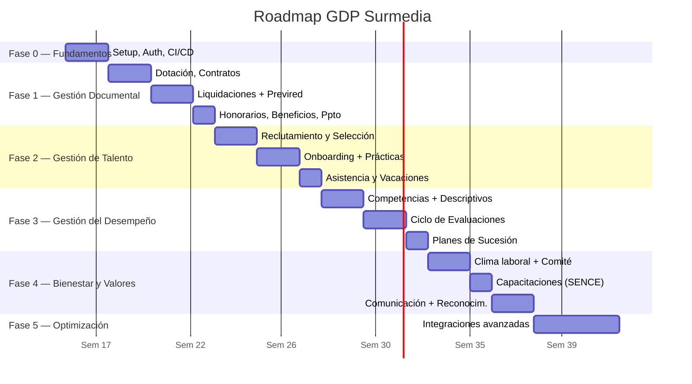

# Roadmap de Desarrollo

Plan de desarrollo del sistema GDP por fases, basado en los **5 macro-módulos del DPDO Surmedia** (fuente: Arquitectura.xlsx).

## Línea de Tiempo por Fases

## Mapa de Módulos vs. Fases

| Macro-módulo | Áreas | Fase |
|---|---|---|
| Gestión Documental | Contratos, dotación, remuneraciones, honorarios, beneficios | Fase 1 |
| Gestión de Talento | Onboarding, reclutamiento, selección, capacitaciones | Fase 2 |
| Gestión del Desempeño | Evaluaciones, competencias, sucesión, descriptivos | Fase 3 |
| Gestión de Bienestar | Clima laboral, CEAL-SUCESO, comité paritario | Fase 4 |
| Gestión de Valores | Comunicación interna, reconocimientos, eventos | Fase 4 |

---

## Fase 0 — Fundamentos (Semanas 1-2)

**Objetivo:** Dejar el proyecto listo para el desarrollo.

### Tareas

- [ ] Definir stack tecnológico definitivo
- [ ] Configurar repositorio y ramas (`main`, `develop`)
- [ ] Configurar GitHub Actions (CI básico: lint + tests)
- [ ] Diseñar schema de base de datos en Prisma
- [ ] Configurar entornos (`development`, `staging`, `production`)
- [ ] Configurar autenticación OAuth con Google (login @surmedia.cl)
- [ ] Levantar proyecto base (Frontend + Backend + DB)
- [ ] Documentar estructura del proyecto en `CLAUDE.md`

**Entregable:** Proyecto ejecutable con login funcional.

---

## Fase 1 — Gestión Documental Core (Semanas 3-7)

**Objetivo:** Digitalizar los procesos más críticos y cotidianos del DPDO: dotación, contratos, remuneraciones y beneficios.

**Macro-módulo:** Gestión Documental (parcial)

### Tareas Backend
- [ ] Módulo `employee` (CRUD + validación RUT)
- [ ] Módulo `department` + `position` (organigrama)
- [ ] Módulo `contract` (generación, vigencias, alertas de vencimiento)
- [ ] Módulo `document` (upload/download Google Drive)
- [ ] Módulo `payroll` (sync desde BUK, informe mensual remuneraciones)
- [ ] Módulo `honorary-receipt` (boletas de honorarios + informe mensual)
- [ ] Módulo `benefit` (Pluxee, seguro complementario, enrolamiento oficina)
- [ ] Módulo `budget` (presupuesto DPDO por categoría)
- [ ] Sistema de roles y permisos

### Tareas Frontend
- [ ] Portal RRHH: ficha del colaborador y listado de dotación
- [ ] Organigrama visual con filtro por área
- [ ] Gestión de contratos y anexos
- [ ] Módulo de liquidaciones (vista colaborador + RRHH)
- [ ] Registro de boletas de honorarios
- [ ] Registro de beneficios por colaborador
- [ ] Dashboard de presupuesto DPDO

### Integraciones
- [ ] Sync inicial desde BUK (importar dotación existente)
- [ ] Webhook BUK → GDP (altas y cambios)
- [ ] Google Drive: estructura de carpetas por colaborador
- [ ] Previred: declaración mensual de cotizaciones
- [ ] Zapier: notificación cuando contrato a plazo fijo vence en 30 días

**Entregable:** RRHH deja de usar Excel como sistema de dotación. Liquidaciones y honorarios con informe mensual automático.

---

## Fase 2 — Gestión de Talento: Onboarding y Reclutamiento (Semanas 8-12)

**Objetivo:** Digitalizar el flujo completo de ingreso de personas, desde la vacante hasta los 90 días del colaborador.

**Macro-módulo:** Gestión de Talento + Gestión Documental (asistencia/vacaciones)

### Tareas Backend
- [ ] Módulo `attendance` (sync BUK Asistencia)
- [ ] Módulo `leave` (solicitudes, aprobaciones, saldos)
- [ ] Módulo `recruitment` (JobPosting, Candidate, Interview, JobOffer)
- [ ] Módulo `onboarding` (checklist dinámico: antecedentes, inducción, mentoría)
- [ ] Módulo `internship` (prácticas + presupuesto)

### Tareas Frontend
- [ ] Dashboard de asistencia para jefaturas
- [ ] Portal del colaborador: solicitar vacaciones/permisos
- [ ] Bandeja de aprobación de permisos
- [ ] Módulo de vacantes y pipeline de candidatos
- [ ] Formulario de carta oferta
- [ ] Checklist de onboarding interactivo (por colaborador)
- [ ] Módulo de prácticas laborales con presupuesto

### Integraciones
- [ ] Sync diario BUK Asistencia → GDP
- [ ] Zapier: vacación aprobada → evento en Google Calendar
- [ ] Trello: nueva incorporación → tarjeta onboarding automática
- [ ] Trello: término de contrato → tarjeta offboarding automática
- [ ] Google Meet: link automático en entrevistas de selección

**Entregable:** Proceso de selección y onboarding completamente digitalizado en GDP. RRHH deja de usar Trello manualmente.

---

## Fase 3 — Gestión del Desempeño (Semanas 13-17)

**Objetivo:** Módulo de evaluaciones, competencias, descriptivos de cargo y planes de sucesión.

**Macro-módulo:** Gestión del Desempeño

### Tareas Backend
- [ ] Módulo `competency` (diccionario de competencias laborales)
- [ ] Módulo `position-description` (descriptivos de cargo versionados)
- [ ] Módulo `performance-cycle` (planificación anual de implementación)
- [ ] Módulo `performance-review` (evaluación individual + autoevaluación)
- [ ] Módulo `succession-plan` (planes de sucesión para cargos clave)
- [ ] Motor de reportes (análisis de métricas de desempeño)

### Tareas Frontend
- [ ] Gestión del diccionario de competencias
- [ ] CRUD de descriptivos de cargo (con versiones)
- [ ] Portal de evaluaciones: autoevaluación y evaluación de jefatura
- [ ] Dashboard de métricas de desempeño por área/período
- [ ] Módulo de planes de sucesión
- [ ] Dashboard gerencial con exportación (Excel, PDF)

### Integraciones
- [ ] Zapier: inicio de ciclo → notificación masiva a evaluadores/evaluados
- [ ] Google Calendar: agendar reuniones de evaluación
- [ ] Sync con BUK (resultados de evaluación)

**Entregable:** Ciclo de evaluación de desempeño 100% en GDP con trazabilidad y reportes.

---

## Fase 4 — Bienestar y Valores (Semanas 18-22)

**Objetivo:** Digitalizar la gestión de clima laboral, reconocimientos, comunicación interna y eventos culturales.

**Macro-módulos:** Gestión de Bienestar Laboral + Gestión de Valores + Capacitaciones

### Tareas Backend
- [ ] Módulo `climate-survey` (CEAL-SUCESO, encuestas internas, comité paritario)
- [ ] Módulo `recognition` (reconocimientos a colaboradores)
- [ ] Módulo `cultural-event` (celebraciones, eventos, Año de la Excelencia)
- [ ] Módulo `internal-communication` (La Alcuza, Círculos SM, canales internos)
- [ ] Módulo `training` (capacitaciones internas y externas, SENCE, copagadas)
- [ ] Módulo `training-enrollment` (inscripciones y certificados)

### Tareas Frontend
- [ ] Portal de encuestas de clima laboral
- [ ] Registro y seguimiento de actas del comité paritario
- [ ] Gestión de reconocimientos
- [ ] Calendario de eventos culturales
- [ ] Gestión de capacitaciones con seguimiento presupuestario (SENCE)
- [ ] Portal del colaborador: mis capacitaciones y certificados
- [ ] Módulo de comunicaciones internas (archivo de La Alcuza, etc.)
- [ ] Automatización de cumpleaños → notificación interna

### Integraciones
- [ ] Google Forms: creación automática de encuestas de clima
- [ ] Zapier: cumpleaños del mes → notificación al canal interno
- [ ] SENCE: registro de cursos (según disponibilidad de API)

**Entregable:** RRHH tiene trazabilidad de bienestar, cultura y capacitación en GDP.

---

## Fase 5 — Optimización y Funciones Avanzadas (Semanas 23+)

**Objetivo:** Mejoras basadas en feedback real del equipo DPDO y funciones avanzadas.

### Funciones Planificadas

- [ ] Integración Smart CTO (datos específicos del equipo tecnológico)
- [ ] Integración DT Digital (iniciativas de transformación)
- [ ] Notificaciones push (app mobile)
- [ ] API pública documentada (Swagger/OpenAPI)
- [ ] Análisis predictivo de rotación
- [ ] Reportes automáticos programados (headcount mensual, rotación, costos)

---

## Deuda Técnica Planificada

| Item | Prioridad | Fase ideal |
|---|---|---|
| Tests de integración completos | Alta | Fase 2 |
| Tests E2E flujos críticos | Alta | Fase 3 |
| Encriptación en reposo (campos sensibles) | Alta | Fase 1 |
| Monitoreo y alertas (Sentry + uptime) | Media | Fase 2 |
| Documentación de API (Swagger/OpenAPI) | Media | Fase 2 |
| Optimización de queries (índices, caché) | Media | Fase 4 |
| Auditoría completa de seguridad | Alta | Fase 3 |

---

## Métricas de Éxito

| Métrica | Meta |
|---|---|
| Tiempo de onboarding de nuevo colaborador | < 30 minutos (desde cero) |
| Tiempo de generación del archivo Previred | < 5 minutos |
| Adopción del portal del colaborador | > 90% del personal en 3 meses |
| Reducción de trabajo manual en RRHH | > 60% |
| Uptime del sistema | > 99.5% |
| Tiempo de respuesta de la API | < 300ms p95 |
